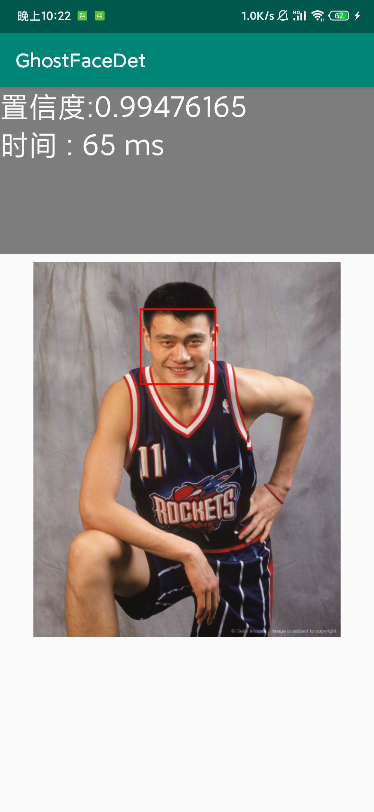

# facedetection_android.pytorch
Light-weight face detection on Android with pytorch model

This is Android demo for [LightWeightFaceDetector](https://github.com/midasklr/LightWeightFaceDetector)

We train a ultra light weight face detection and landmark align model which is only 643.7 k.

## wider face validation performance

| Models                    | Easy    | Medium   | Hard    | Model Size |
| ------------------------- | ------- | -------- | ------- | ---------- |
| mobilenetv1_0.25          | 0.91718 | 0.79766  | 0.3592  | 1.6 M      |
| mobilenetv2_0.1           | 0.85330 | 0.68946  | 0.2993  | 1.3 M      |
| mobilenetv3_small         | 0.93419 | 0.83259  | 0.3850  | 2.8 M      |
| efficientnet-b0           | 0.93167 | 0.81466  | 0.37020 | 16.4 M     |
| mobilenetv2_0.1_lite_3fpn | 0.80379 | 0.716958 | 0.34924 | 426 k      |
| mobilenetv2_0.1_lite_3pan | 0.83309 | 0.77181  | 0.5301  | 643.7 k    |
| mobilenetv2_0.1_lite_4pan | 0.83965 | 0.791419 | 0.5964  | 813 k      |

## Android Pytorch Detection

This demo is follow the [Android](https://pytorch.org/) resnet18 demo.

After pytorch 1.3, pytorch model can be easily deploy to android, see [details](https://blog.csdn.net/IEEE_FELLOW/article/details/108420007) for how to deploy ur pytorch model.

